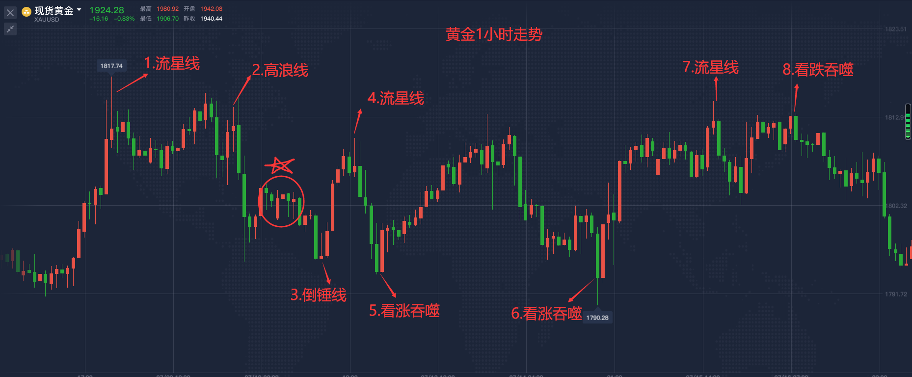

# 小散户也能使用的股票预测
基于传统方法的股票预测，利用傅里叶变换和其他拟合方法即可进行股票预测。
## 环境要求：
* python3.8+
* akshare (tushare收费了恶心)
* numpy
## 每周运行结果：

如图所示，后5天为预测结果。
## A股规律：
元旦后：关注水产、酒店和预制菜板块。

春节前（一月底到二月初）：关注旅游和电影院板块。

过了春节（二月初）：关注矿产、PCB等原材料和工程建设板块。

四月底：关注风能储存、电池、汽车、电力、化纤等板块。

四月底到五月初：大跌一次，原因是年报公布，大家要避险。

八月中旬：关注半导体板块。

八月中旬到九月初：大跌一次，原因是中报公布，大家要避险。

国庆前后（十月）：关注互联网和医药板块。

十月底到十一月初：大跌一次，原因是三季报公布，大家要避险。

十二月份：关注白酒、食品饮料和商业百货。

十二月底到一月初：大跌一次，原因是大家要避险，准备过年。

根据以上规律，A股市场每年有四次大跌，分别在四月底、八月底、国庆前后和春节前后。这些大跌的原因分别是年报、中报、三季报的公布，以及大家为了避险而撤离市场。在不同的时间段，投资者可以关注不同的板块进行投资，以抓住市场的机会。
